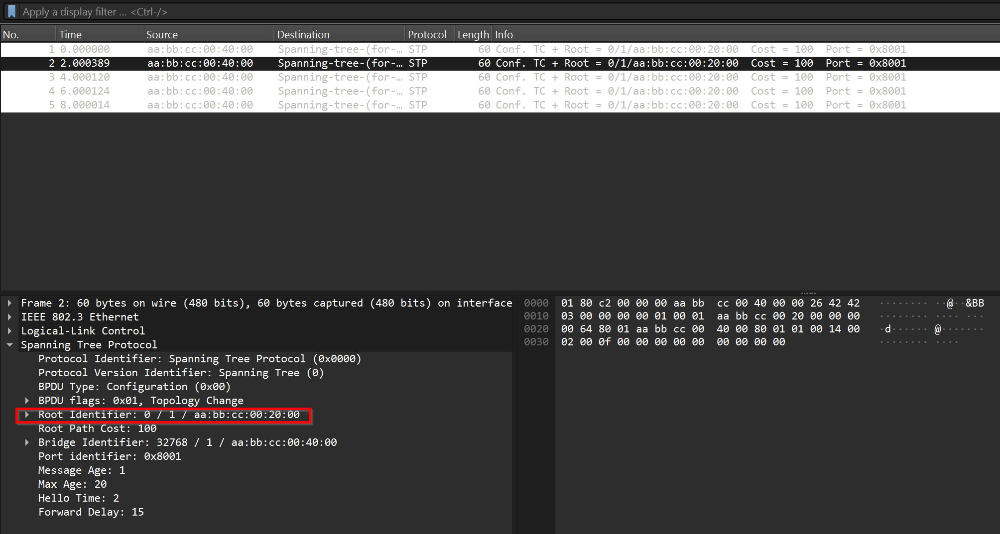
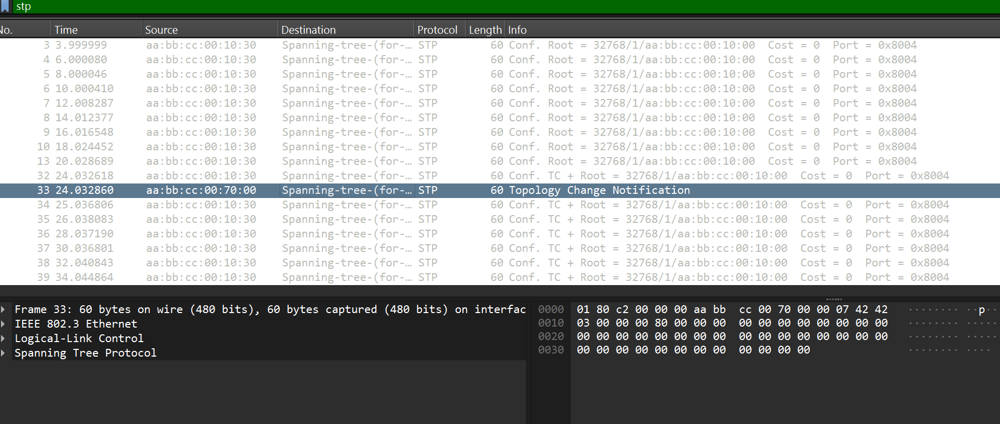

# SWR-lab1-STP - Rapport
> 1. Pourquoi l’utilisation de STP est-elle nécessaire avec une telle topologie réseau ?

Car une boucle existe entre les switchs.

> 2. Est-ce que les switches utilisés dans cette simulation ont STP activé par défaut ? Justifiez votre réponse avec une capture WireShark du trafic entre les switches.

Oui le protocole STP semble actif par défaut.


> 3. Quelle est la différence entre la topologie initiale et celle ci-dessous ?

Le switch 3 n'est pas présent et cela supprime la boucle.

> 4. Comment est élu le root bridge dans notre cas, étant donné qu’aucune priorité n’est configurée ? 

Le switch ayant l'adresse MAC la plus basse est sélectionné pour être le root bridge.

> 5. Trouvez l’adresse MAC de chacun des switches dans le réseau que vous avez simulé. Aidez-vous de la commande show interfaces.

| Switch | MAC address 0/0 | MAC address 0/1 | MAC address 0/2 |  MAC address 0/2 |
| ------- | ---------- | ---------- | ---------- | ------ |
| S1 | aabb.cc00.1000 | aabb.cc00.1010 | aabb.cc00.1020 | aabb.cc00.1030 |
| S2 | aabb.cc00.2000 | aabb.cc00.2010 | aabb.cc00.2020 | aabb.cc00.2030 |
| S3 | aabb.cc00.3000 | aabb.cc00.3010 | aabb.cc00.3020 | aabb.cc00.3030 |
| S4 | aabb.cc00.4000 | aabb.cc00.4010 | aabb.cc00.4020 | aabb.cc00.4030 |

> 6. Pourquoi y’a-t-il plusieurs adresses MAC sur un switch ?

Il y a une MAC adresse par port.

> 7. En vous basant sur votre réponse, qui devra être le switch élu dans votre réseau?

Le S1 sera l'élu.

> 8. Vérifiez votre réponse à l’aide des paquets STP échangés et joignez une capture d’écran.


> 9. Créez un schéma du réseau et représentez le switch racine ainsi que les ports racines, désignés et bloqués en utilisant les connaissances acquises en cours. Indiquez également le chemin que devrait emprunter un ping entre PC1 et PC2. Prouvez-le en exécutant le ping et en joignant une capture d’écran (en capturant entre S1 et S4 ou S1 et S3 par exemple).


Des trames ICMP sont visibles entre entre les switch S1 et S3 mais pas entre les switch S1 et S4.

Capture S4 
Capture S3 

> 10. En milieu de boucle (entre deux autres switches), Repérez le switch par lequel le ping passait entre PC1 et PC2. Choisissez une des deux interfaces connectées. 
> a. Lancez une capture Wireshark sur l’interface choisie. 
> b. Après quelques secondes, une trame STP un peu spéciale devrait apparaître sur la capture, de quoi s’agit-il ?

a) Le ping passe par le switch S3
b) La nouvelle trame notifie d'un changement dans la topologie 
 


> 11. Attendez un instant et refaites un ping. Joignez une capture d’écran prouvant que le ping emprunte un chemin différent cette fois-ci.

Nous pouvons constater que le ping passe maintenant par le switch S4
 

> 12.  Pourquoi faut-il attendre quelques secondes avant de pouvoir communiquer après avoir eu un changement de topologie ?

Une fois le changement de topologie notifié, le BPDU doit être recalculé et cela prend un peu de temps.

> 13.  Est-ce qu’un nouveau root bridge a été élu ? Justifiez votre réponse.

Non, un nouveau root bridge n'a pas été élu car le cost a été augmenté sur le S3 et et non pas le S1 qui est le root bridge actuel.

> 14.  Nous allons maintenant forcer l’élection d’un autre switch en tant que racine. Quel est le paramètre à modifier pour ce faire ?

Il faut augmenter la priorité du spanning tree sur le switch S1 pour qu'un autre switch avec une priorité moins élevée devienne la racine.

> 15.  Modifiez ce paramètre et indiquez également la commande utilisée pour le changer. Vérifiez qu’un nouveau switch a été élu root.

Augmentation de la priority du spanning-tree sur le switch S1
```bash
Switch#conf t
Switch(config)#spanning-tree vlan 1 priority 4096
```
Diminution de la priorité du spanning-tree sur le switch S2
```bash
Switch#conf t
Switch(config)#spanning-tree vlan 1 priority 0
```
Nous constatons ici que le nouveau switch racine est le swicth S2


> 16.  Modifiez la topologie existante de sorte à obtenir le réseau suivant :
> a. Quel switch sera élu comme racine avec ce nouveau réseau ?
> b. Quels sont les ports racine, désignés et bloqués ?
> c. Quel serait le chemin emprunté par un ping entre PC1 et PC2 ? Justifiez votre réponse avec une capture Wireshark.

a) Le switch racine reste le S1 
b) Les ports devraient rester comme auparavant à l'exception des ports concernés par le nouveau lien créer pour cette question qui eux seront bloqués.
c) Le passe par le switch S4 comme démontré dans la capture ci-dessous : 

> 17. Lancez une capture Wireshark entre deux switches. Montrez l’évolution du contenu des trames STP durant le processus d’élection du root. Vous pouvez redémarrer les switches afin de réinitialiser les configurations précédentes. 

Afin de mieux observer le processus d'élection de la racine, nous avons ajouté un nouveau switch S5 afin de pouvoir observer l'annonce de celui-ci comme racine. Pour pouvoir observer cet évènement le S5 est démarré après tous les autres switchs.

Nous observons sur la capture d'écran ci-dessous la "Topology change notification" qui annonce représente l'annonce du S5 comme racine temporairement.

